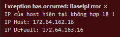

# HttpAntiDebug #
https://github.com/taile-software/HttpAntiDebug

Hiện tại có rất nhiều đối tượng xấu đã sử sụng 1 thủ thuật là bắt traffic http để có response và fake 1 server localhost để fake server của 1 phần mềm, tools,...
Thư viện này sẽ giúp bạn vá đi được phần nào đó của lỗ hổng này ( không thể an toàn tuyệt đối )

* Vẫn hoạt động ổn định cho tới hiện tại
* Sử dụng Python >= 3.6

## Installation ##
```
pip install HttpAntiDebug
```
hoặc bạn có thể install từ github: 
```
pip install git+https://github.com/taile-software/HttpAntiDebug@master
```

## Mô tả ##

